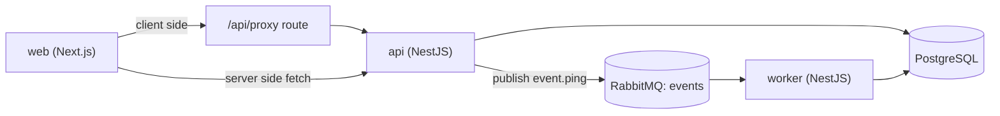

# CLAUDE.md

Guidelines for developing this repository. Read this before making changes.

## What this repo is

- A starter monorepo template for new projects.
- Three runnable apps plus shared packages.
- Goal: clone it, rename, and start building.

## Stack

- Turborepo + pnpm (Node >= 22, pnpm 10.32.1).
- TypeScript everywhere.
- Web: Next.js 16, next-intl, next-themes, Tailwind 4, shadcn/ui.
- API and worker: NestJS 11.
- Messaging: RabbitMQ (`@golevelup/nestjs-rabbitmq`).
- Database: Prisma 6 + PostgreSQL.

## Folder layout

```
apps/
  web/        Next.js frontend
  api/        NestJS REST API
  worker/     NestJS background worker
packages/
  ui/
    components/   @repo/ui                shared React components
    tailwind/     @repo/tailwind-config   shared Tailwind config
  logic/
    types/        @repo/types             shared types and zod schemas
    utils/        @repo/utils             shared helper functions
    database/     @repo/database          Prisma client and schema
  config/
    eslint/       @repo/eslint-config     shared ESLint config
    typescript/   @repo/typescript-config shared tsconfig
```

- Packages are grouped by concern: `ui`, `logic`, `config`.
- The group folders are not packages. Each leaf folder is one package.
- The workspace glob is `packages/*/*`.

## Architecture



## Agents and dev workflow

- Each app has a scoped `AGENTS.md` next to its code.
    - `apps/web/AGENTS.md`, `apps/api/AGENTS.md`, `apps/worker/AGENTS.md`.
    - This root `CLAUDE.md` holds cross-cutting rules.
    - The app file holds app-specific rules. The closest file wins.
- Each app has a matching dev subagent in `.claude/agents/`.
    - `web-dev`, `api-dev`, `worker-dev`.

**Rule: when work is scoped to one app, develop it through that app's subagent.**

| Work in       | Spawn subagent |
| ------------- | -------------- |
| `apps/web`    | `web-dev`      |
| `apps/api`    | `api-dev`      |
| `apps/worker` | `worker-dev`   |

- Each subagent reads its app's `AGENTS.md` first.
- It works only inside that app, then runs `lint` and `typecheck`.
- Cross-app or shared-package changes stay in the main session.

### Three layers — context and duty

| File                          | Duty                           | Who reads it             | Enters context when                     |
| ----------------------------- | ------------------------------ | ------------------------ | --------------------------------------- |
| `CLAUDE.md` (root)            | Repo-wide rules                | Main agent + subagents   | Auto-loaded every session               |
| `.claude/agents/<app>-dev.md` | Defines the app's dev subagent | Main agent (for routing) | Loaded as a definition at session start |
| `apps/<app>/AGENTS.md`        | App-specific details           | That app's subagent      | Read by the subagent while it works     |

- `CLAUDE.md`: the repo "constitution". No app-specific detail here.
- `<app>-dev.md`: its `description` decides when to spawn; its body is the system prompt.
- `AGENTS.md`: the on-site manual for one app. Closest file wins.

How a task flows:

```
Main agent (CLAUDE.md already loaded)
  -> matches the task to a subagent description
  -> spawns <app>-dev (its body becomes the system prompt)
  -> subagent reads apps/<app>/AGENTS.md first
  -> edits only that app, then runs lint + typecheck
  -> returns a summary to the main session
```

- Custom subagents also load `CLAUDE.md`. They must read `AGENTS.md` themselves; their body tells them to.

## Conventions

### Code style

- Defined in `.prettierrc` and `.editorconfig`.
- 4-space indent.
- No semicolons.
- Double quotes.
- Trailing comma: all.
- Line ending: LF.
- Run `pnpm lint` and `pnpm typecheck` before committing.
- Run `pnpm format` to auto-format, `pnpm format:check` to verify.

### Comments

- Keep them short. Cap 3 lines.
- Explain the reason or gotcha, not what the code already says.

### Dependency versions — use the catalog

- All external versions live in `pnpm-workspace.yaml` under `catalog:`.
- In any `package.json`, reference a version with `"catalog:"`.
- Do not write a literal version like `"^19.0.0"` in a `package.json`.
- Exception: `peerDependencies` keep a literal range (e.g. `@repo/ui`).
- To upgrade a dependency: edit the version in `pnpm-workspace.yaml`, then run `pnpm install`.

### Internal packages

- Reference them with `"workspace:*"`.
- Import by package name, e.g. `import { prisma } from '@repo/database'`.

## Apps

- Each app's details live in its own `AGENTS.md`. The closest file wins.
    - `apps/web/AGENTS.md` — Next.js frontend.
    - `apps/api/AGENTS.md` — NestJS REST API.
    - `apps/worker/AGENTS.md` — NestJS background worker.
- See also "Agents and dev workflow" above for which subagent to spawn.

## RabbitMQ contract

- Connects the api publisher and the worker consumer.
- The single source of truth is `@repo/types`: `EVENTS_EXCHANGE`, `PING_ROUTING_KEY`, `PingEvent`.
- Per-app details are in `apps/api/AGENTS.md` and `apps/worker/AGENTS.md`.
- RabbitMQ is opt-in. It loads only when `RABBITMQ_ENABLE=true`.
    - Default is `false`, so you can run only api and web with no broker.
    - api loads the broker connection with `ConditionalModule` from `@nestjs/config`.
    - When off, `/events/ping` returns `503` because the connection is absent.
    - When off, the worker boots but stays idle (no consumers).

## Database (Prisma)

- Multi-file schema folder: `packages/logic/database/prisma/schema/`.
    - `schema.prisma` holds the `generator` and `datasource`.
    - Models live in their own files, e.g. `example.prisma`.
    - Add a model = add a new `.prisma` file in this folder. Prisma merges them.
- Starter model is `Example`. Replace it with your own.
- Config: `packages/logic/database/prisma.config.ts`.
    - Sets the schema folder and the `prisma/migrations` path.
    - Loads the repo-root `.env` (a config file turns off Prisma's auto `.env` loading).
    - So the `db:*` scripts are plain `prisma` commands, no `dotenv-cli`.
- Client is a singleton exported from `@repo/database`.
- Migrations are committed to git. They are the history of schema changes and `prisma migrate deploy` replays them in every environment.
- Migrations run from the repo root with `pnpm db:migrate`.
- `pnpm db:reset` drops and recreates the dev database.

## Environment

- Copy `.env.example` to `.env` before running.

| Variable              | Used by             | Purpose                                      |
| --------------------- | ------------------- | -------------------------------------------- |
| `DATABASE_URL`        | api, worker, prisma | PostgreSQL connection                        |
| `RABBITMQ_ENABLE`     | api, worker         | Turn RabbitMQ on (default `false`)           |
| `RABBITMQ_URL`        | api, worker         | RabbitMQ connection (required when enabled)  |
| `PORT`                | api                 | API port (default 4000)                      |
| `FRONTEND_URL`        | api                 | CORS origin                                  |
| `NEXT_PUBLIC_API_URL` | web (browser)       | API base for the browser                     |
| `API_INTERNAL_URL`    | web (server)        | API base for Server Components and the proxy |

- `api` and `worker` validate env at startup with zod schemas in `@repo/types`.
    - Schemas: `apiEnvSchema`, `workerEnvSchema`.
    - A missing or bad value stops the app on boot instead of failing later.

## Commands

- Run from the repo root.

| Command             | What it does                       |
| ------------------- | ---------------------------------- |
| `pnpm dev`          | Run all apps in dev mode           |
| `pnpm build`        | Build all apps and packages        |
| `pnpm lint`         | Lint all packages                  |
| `pnpm typecheck`    | Type-check all packages (`tsc`)    |
| `pnpm format`       | Format the repo with Prettier      |
| `pnpm format:check` | Check formatting without writing   |
| `pnpm db:migrate`   | Run a Prisma migration (dev)       |
| `pnpm db:reset`     | Drop and recreate the dev database |
| `pnpm db:seed`      | Seed the database                  |
| `pnpm db:studio`    | Open Prisma Studio                 |

- Target one workspace with a filter, e.g. `pnpm --filter api build`.

## Local setup

1. `docker compose up -d` (PostgreSQL + RabbitMQ).
2. `cp .env.example .env`.
3. `pnpm install`.
4. `pnpm db:migrate`.
5. `pnpm dev`.

URLs:

- Web: http://localhost:3000
- API: http://localhost:4000
- Swagger: http://localhost:4000/api/docs
- RabbitMQ UI: http://localhost:15672 (user `rabbit`, pass `rabbit`)

## How to extend

### Add an app

1. Create the app under `apps/<name>`.
2. Add `apps/<name>/AGENTS.md` with the app's scoped rules.
3. Add `.claude/agents/<name>-dev.md` as its dev subagent.
4. List the new app in the "Agents and dev workflow" table above.

### Add a language

1. Add `apps/web/src/messages/<locale>.json`.
2. Add the locale to `apps/web/src/i18n/config.ts`.

### Add a shared package

1. Create a folder under the right group: `packages/ui`, `packages/logic`, or `packages/config`.
2. Add a `package.json` with name `@repo/<name>` and `"private": true`.
3. Use `"catalog:"` for any external dependency.
4. Run `pnpm install`.

### Add a dependency

1. Add the version to `catalog:` in `pnpm-workspace.yaml`.
2. Reference it as `"catalog:"` in the package that needs it.
3. Run `pnpm install`.

### Add an API endpoint

1. Create a module under `apps/api/src/modules`.
2. Register it in `app.module.ts`.
3. Use a zod schema in `@repo/types` for the request DTO.
4. To call it from web: add the path to `lib/api/endpoints.ts` and a typed function in a domain file.

### Add a queue event

1. Add the routing key and event type to `@repo/types`.
2. Publish from a service in `apps/api`.
3. Add a consumer in `apps/worker/src/consumers`.

### Add auth later

- This template ships without auth.
- When needed, add `better-auth` with the Prisma adapter in `apps/api` and a client in `apps/web`.

## Gotchas

- RabbitMQ is off by default. Set `RABBITMQ_ENABLE=true` (and start Docker) to use the queue.
- With RabbitMQ on but the broker down, publishing returns `503` after 5 seconds. Start Docker first.
- With RabbitMQ off, `/events/ping` returns `503` right away because no connection is loaded.
- The theme toggle gates render on mount to avoid hydration mismatch. The needed `eslint-disable` for `react-hooks/set-state-in-effect` is intentional.
- NestJS local imports need the `.js` extension because of `nodenext`. Omitting it breaks the build.
- Web imports from `@repo/*` need those packages listed in `transpilePackages`.

## History — how this template was built

Order of decisions and work, newest last.

1. Chose the stack: Turborepo + pnpm, Next.js + NestJS + worker.
2. Grouped packages into `ui`, `logic`, `config` (workspace glob `packages/*/*`).
3. Set i18n to English only, theme default to `system`.
4. Built web with routing and both server side and client side health check demos, plus a proxy route.
5. Built api with Swagger, a health check, and an events endpoint that publishes to RabbitMQ.
6. Built worker as a RabbitMQ consumer.
7. Dropped auth to keep the template light. Kept Prisma with an `Example` model.
8. Dropped tests for a clean start.
9. Verified install, build, and lint. Smoke tested the API health endpoint and Swagger.
10. Added a 5 second publish timeout so the ping endpoint fails fast when the broker is down.
11. Set `rootDir` in the NestJS tsconfig files to silence a TypeScript hint.
12. Initialized git and pushed to a private GitHub repo.
13. Centralized all dependency versions with the pnpm catalog.
14. Tested the RabbitMQ flow end to end with Docker and fixed database env loading.
15. Wrapped web API calls in typed domain functions so endpoints live in one place.
16. Split the Prisma schema into a multi-file folder, added `prisma.config.ts`, and committed migrations.
17. Added a `typecheck` task, env validation in `@repo/types`, root `db:reset`, and Prettier `format` scripts.
18. Added per-app `AGENTS.md` files and matching `<app>-dev` subagents, plus the dev workflow rule.
