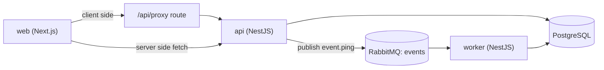

# CLAUDE.md

Guidelines for developing this repository. Read this before making changes.

## What this repo is

- A starter monorepo template for new projects.
- Three runnable apps plus shared packages.
- Goal: clone it, rename, and start building.

## Stack

- Turborepo + pnpm (Node >= 22, pnpm 10.32.1).
- TypeScript everywhere.
- Web: Next.js 16, next-intl, next-themes, Tailwind 4, shadcn/ui.
- API and worker: NestJS 11.
- Messaging: RabbitMQ (`@golevelup/nestjs-rabbitmq`).
- Database: Prisma 6 + PostgreSQL.

## Folder layout

```
apps/
  web/        Next.js frontend
  api/        NestJS REST API
  worker/     NestJS background worker
packages/
  ui/
    components/   @repo/ui                shared React components
    tailwind/     @repo/tailwind-config   shared Tailwind config
  logic/
    types/        @repo/types             shared types and zod schemas
    utils/        @repo/utils             shared helper functions
    database/     @repo/database          Prisma client and schema
  config/
    eslint/       @repo/eslint-config     shared ESLint config
    typescript/   @repo/typescript-config shared tsconfig
```

- Packages are grouped by concern: `ui`, `logic`, `config`.
- The group folders are not packages. Each leaf folder is one package.
- The workspace glob is `packages/*/*`.

## Architecture



## Conventions

### Code style

- Defined in `.prettierrc` and `.editorconfig`.
- 4-space indent.
- No semicolons.
- Single quotes.
- Trailing comma: all.
- Line ending: LF.
- Run `pnpm lint` before committing.

### Comments

- Keep them short. Cap 3 lines.
- Explain the reason or gotcha, not what the code already says.

### Dependency versions — use the catalog

- All external versions live in `pnpm-workspace.yaml` under `catalog:`.
- In any `package.json`, reference a version with `"catalog:"`.
- Do not write a literal version like `"^19.0.0"` in a `package.json`.
- Exception: `peerDependencies` keep a literal range (e.g. `@repo/ui`).
- To upgrade a dependency: edit the version in `pnpm-workspace.yaml`, then run `pnpm install`.

### Internal packages

- Reference them with `"workspace:*"`.
- Import by package name, e.g. `import { prisma } from '@repo/database'`.

## Apps

### web (Next.js)

- App Router under `apps/web/src/app`.
- Routes: `/` (landing), `/server`, `/client`.
- i18n: `next-intl`. Locale comes from a `locale` cookie. Default `en`.
- Theme: `next-themes`. Options light / dark / system. Default `system`.
- UI: shadcn components live in `apps/web/src/components/ui`.
- `transpilePackages` in `next.config.ts` lists the `@repo/*` packages it imports.

Server side vs client side:

| | Server side (`/server`) | Client side (`/client`) |
|---|---|---|
| Component | Server Component | Client Component (`'use client'`) |
| Fetch runs | on the server during render | in the browser after load |
| Helper | `serverApi()` in `lib/server-api.ts` | `api()` in `lib/api.ts` |
| Target | `API_INTERNAL_URL` directly | `/api/proxy` route |
| Caching | `no-store`, `force-dynamic` | per request |

- The proxy route is `apps/web/src/app/api/proxy/[...path]/route.ts`.
- It forwards `/api/proxy/<path>` to `<API_URL>/api/<path>` with cookies.

### api (NestJS)

- Entry: `apps/api/src/main.ts`.
- Global route prefix is `api`. So health is at `/api/health`.
- Swagger UI at `/api/docs`.
- Validation: `nestjs-zod` global pipe. DTOs use `createZodDto` with a zod schema from `@repo/types`.
- Endpoints:
  - `GET /api/health` returns `{ status: 'ok', timestamp }`.
  - `POST /api/events/ping` publishes an event to RabbitMQ.
- Publishing has a 5 second timeout. If the broker is down it returns `503`, it does not hang.

### worker (NestJS)

- Entry: `apps/worker/src/main.ts`. Runs as an application context, no HTTP server.
- Consumes RabbitMQ events.
- `EventConsumer` listens on routing key `event.ping` and logs the message.

### NestJS specifics (api and worker)

- ESM with `module`/`moduleResolution` set to `nodenext`.
- Local imports must use the `.js` extension, e.g. `import { AppModule } from './app.module.js'`.
- Runtime uses `tsx`. Build uses the Nest CLI with the `swc` builder.
- `tsconfig.json` sets `rootDir` to `./src` and `outDir` to `./dist`.

## RabbitMQ contract

- Exchange `events`, type `topic`.
- Routing key `event.ping`.
- Worker queue `worker.event.ping`.
- Shared constants live in `@repo/types` (`EVENTS_EXCHANGE`, `PING_ROUTING_KEY`).
- The event shape is `PingEvent` in `@repo/types`. Keep publisher and consumer in sync through this type.

## Database (Prisma)

- Schema: `packages/logic/database/prisma/schema.prisma`.
- Starter model is `Example`. Replace it with your own.
- Client is a singleton exported from `@repo/database`.
- Migrations run from the repo root with `pnpm db:migrate`.
- The `db:*` scripts use `dotenv-cli` to load the root `.env`, because Prisma runs inside the package and would not see it otherwise.

## Environment

- Copy `.env.example` to `.env` before running.

| Variable | Used by | Purpose |
|---|---|---|
| `DATABASE_URL` | api, worker, prisma | PostgreSQL connection |
| `RABBITMQ_URL` | api, worker | RabbitMQ connection |
| `PORT` | api | API port (default 4000) |
| `FRONTEND_URL` | api | CORS origin |
| `NEXT_PUBLIC_API_URL` | web (browser) | API base for the browser |
| `API_INTERNAL_URL` | web (server) | API base for Server Components and the proxy |

## Commands

- Run from the repo root.

| Command | What it does |
|---|---|
| `pnpm dev` | Run all apps in dev mode |
| `pnpm build` | Build all apps and packages |
| `pnpm lint` | Lint all packages |
| `pnpm db:migrate` | Run a Prisma migration (dev) |
| `pnpm db:seed` | Seed the database |
| `pnpm db:studio` | Open Prisma Studio |

- Target one workspace with a filter, e.g. `pnpm --filter api build`.

## Local setup

1. `docker compose up -d` (PostgreSQL + RabbitMQ).
2. `cp .env.example .env`.
3. `pnpm install`.
4. `pnpm db:migrate`.
5. `pnpm dev`.

URLs:

- Web: http://localhost:3000
- API: http://localhost:4000
- Swagger: http://localhost:4000/api/docs
- RabbitMQ UI: http://localhost:15672 (user `rabbit`, pass `rabbit`)

## How to extend

### Add a language

1. Add `apps/web/src/messages/<locale>.json`.
2. Add the locale to `apps/web/src/i18n/config.ts`.

### Add a shared package

1. Create a folder under the right group: `packages/ui`, `packages/logic`, or `packages/config`.
2. Add a `package.json` with name `@repo/<name>` and `"private": true`.
3. Use `"catalog:"` for any external dependency.
4. Run `pnpm install`.

### Add a dependency

1. Add the version to `catalog:` in `pnpm-workspace.yaml`.
2. Reference it as `"catalog:"` in the package that needs it.
3. Run `pnpm install`.

### Add an API endpoint

1. Create a module under `apps/api/src/modules`.
2. Register it in `app.module.ts`.
3. Use a zod schema in `@repo/types` for the request DTO.

### Add a queue event

1. Add the routing key and event type to `@repo/types`.
2. Publish from a service in `apps/api`.
3. Add a consumer in `apps/worker/src/consumers`.

### Add auth later

- This template ships without auth.
- When needed, add `better-auth` with the Prisma adapter in `apps/api` and a client in `apps/web`.

## Gotchas

- Publishing to RabbitMQ when the broker is down returns `503` after 5 seconds. Start Docker first.
- The theme toggle gates render on mount to avoid hydration mismatch. The needed `eslint-disable` for `react-hooks/set-state-in-effect` is intentional.
- NestJS local imports need the `.js` extension because of `nodenext`. Omitting it breaks the build.
- Web imports from `@repo/*` need those packages listed in `transpilePackages`.

## History — how this template was built

Order of decisions and work, newest last.

1. Chose the stack: Turborepo + pnpm, Next.js + NestJS + worker.
2. Grouped packages into `ui`, `logic`, `config` (workspace glob `packages/*/*`).
3. Set i18n to English only, theme default to `system`.
4. Built web with routing and both server side and client side health check demos, plus a proxy route.
5. Built api with Swagger, a health check, and an events endpoint that publishes to RabbitMQ.
6. Built worker as a RabbitMQ consumer.
7. Dropped auth to keep the template light. Kept Prisma with an `Example` model.
8. Dropped tests for a clean start.
9. Verified install, build, and lint. Smoke tested the API health endpoint and Swagger.
10. Added a 5 second publish timeout so the ping endpoint fails fast when the broker is down.
11. Set `rootDir` in the NestJS tsconfig files to silence a TypeScript hint.
12. Initialized git and pushed to a private GitHub repo.
13. Centralized all dependency versions with the pnpm catalog.
